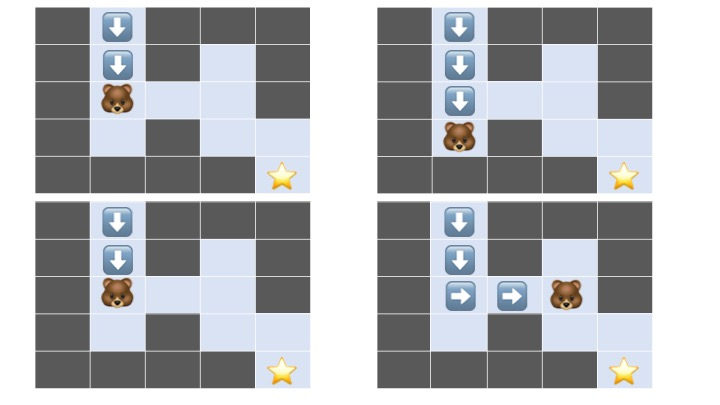

## Backtracking 
해결책에 대한 후보를 구축해 나아가다 가능성이 없다고 판단되는 즉시 후보를 포기해 정답을 찾아가는 알고리즘.
탐색하다가 더 갈 수 없으면 왔던 길을 되돌아가 다른 길을 찾는다는 데서 유래했다.
DFS와 같은 방식으로 탐색하는 모든 방법을 뜻하며, DFS는 백트래킹의 골격을 이루는 알고리즘이다.
주로 재귀로 구현하며, 알고리즘마다 DFS변형이 조금씩 일어나지만 기본적으로 모두 DFS 범주에 속한다.
운이 좋으면 빨리 가지만, 운이 안좋으면 모든 경우의 수를 다 확인한다. 

선택을 반복하면서 최종 목표에 도달한다.
노드의 부모로 돌아가 다음 자식 노드로 이동한다. 
**깊이우선탐색과 다른 점은 한번 확인 후 가능성이 없는 경우(=유망하지 않은 경우)에는 차단하고 진행한다.**