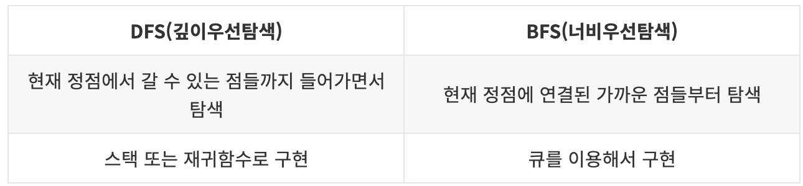

# DFS / BFS
## 그래프란?  
노드와 그 노드를 연결하는 간선(edge)으로 이루어진 자료구조의 일종을 말하며, 그래프를 탐색한다는 것은 하나의 노드로부터 시작하여 차례대로 모든 노드들을 한 번씩 탐색하는 것을 말한다.  

그래프를 탐색하는 방법에는 크게 아래 2가지 방법이 있다.
- 깊이 우선 탐색 (DFS)
- 너비 우선 탐색 (BFS)

## 깊이 우선 탐색 (DFS, Depth-First Search)
최대한 깊이 내려간 뒤, 더이상 깊이 갈 곳이 없을 경우 옆으로 이동한다.  

### 깊이 우선 탐색의 개념
임의의 노드부터 시작해서 다음 분기(branch)로 넘어가기 전에 해당 분기를 완벽하게 탐색하는 방식을 말한다. 모든 노드를 방문하고자 하는 경우에 이 방법을 선택한다.

예를 들어, 미로찾기를 할 때 최대한 한 방향으로 갈 수 있을 때까지 쭉 가다가 더 이상 갈 수 없게 되면 다시 가장 가까운 갈림길로 돌아와서 그 갈림길부터 다시 다른 방향으로 탐색을 진행하는 것이 깊이 우선 탐색 방식이라고 할 수 있다.

## 너비 우선 탐색 (BFS, Breadth-First Search)
최대한 넓게 이동한 다음, 더 이상 갈 수 없을 때 아래로 이동한다.  

### 너비 우선 탐색의 개념
임의의 노드에서 시작해서 인접한 노드를 먼저 탐색하는 방법으로, 시작 노드로부터 가까운 노드를 먼저 방문하고 멀리 떨어져 있는 노드를 나중에 탐색하는 순회 방법이다. 주로 두 노드 사이의 최단 경로를 찾고 싶을 때 이 방법을 선택한다.

지구 상에 존재하는 모든 친구 관계를 그래프로 표현한 후 sam과 jhon 사이에 존재하는 경로를 찾는 경우

- 깊이 우선 탐색 : 모든 친구 관계를 다 살펴봐야 할지도 모름
- 너비 우선 탐색 : sam과 가까운 관계부터 탐색

## 깊이 우선 탐색(DFS)과 너비 우선 탐색(BFS) 비교
  
  

- 탐색 속도는 깊이 우선 탐색보다 너비 우선 탐색이 빠르다. (깊이 우선 탐색은 모든 노드를 탐색하기 때문)
- 구현 방식은 너비 우선 탐색이 깊이 우선 탐색보다 좀 더 간단한다.
