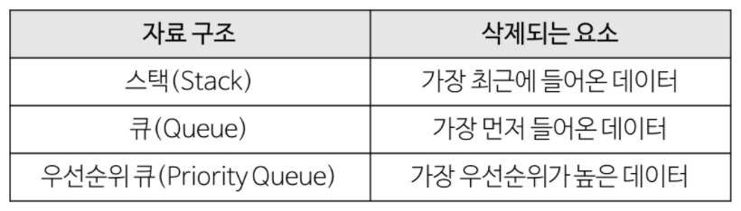
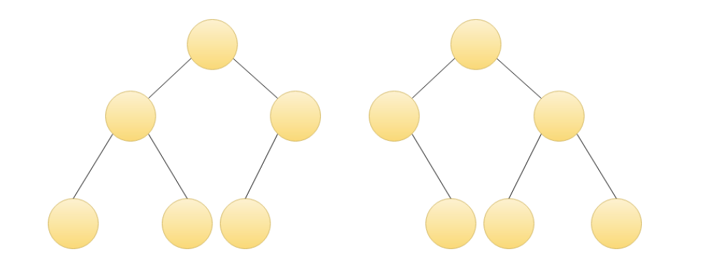
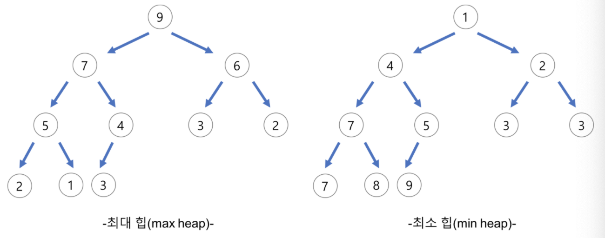
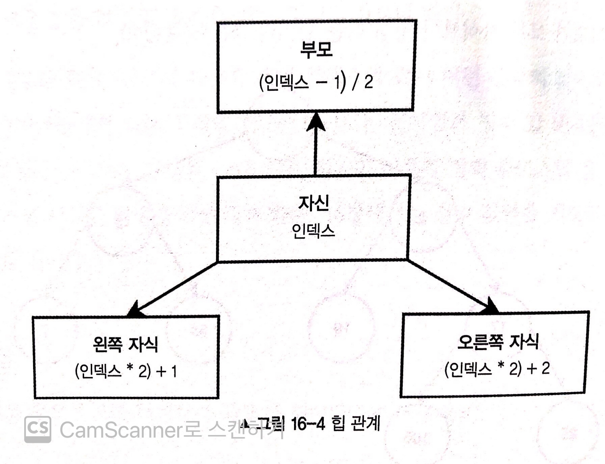
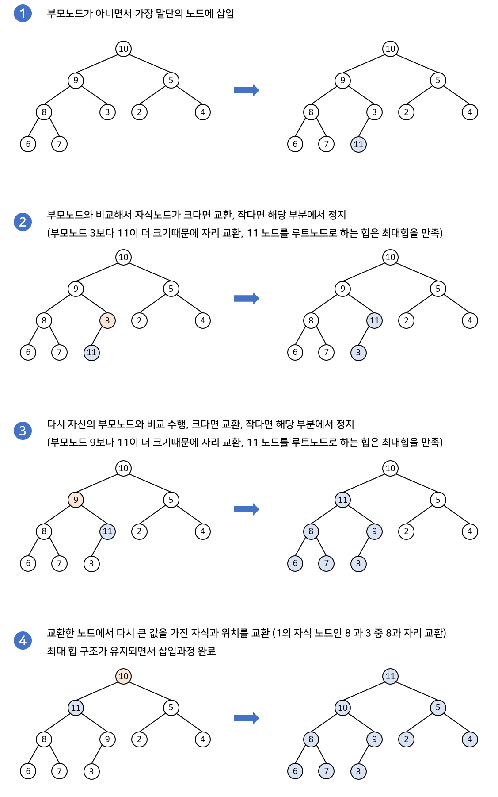

# Heap
## 힙 이란?
- 우선순위 큐를 위하여 만들어진 자료구조.  
  여러 개의 값들 중에서 최댓값이나 최솟값을 빠르게 찾아내기 위해 만들어졌다.
- 완전 이진 트리를 기초로 한다.

### 우선순위 큐
큐에 우선순위의 개념을 도입한 자료구조.  
데이터들이 우선순위를 가지고 있고 우선순위가 높은 데이터부터 먼저 나간다.


### 완전 이진 트리
- 자식 노드는 최대 2개까지 가질 수 있다.
- 리프 노드의 가장 왼쪽부터 노드를 채운다.
- 마지막 레벨을 제외하고 모든 레벨이 완전히 채워져 있다.

위 그림에서 왼쪽은 완전 이진 트리이지만, 오른쪽은 아니다.

## 힙의 종류

- __최대 힙 (max heap)__  
  부모 노드의 키 값이 자식 노드의 키 값보다 크거나 같은 완전 이진 트리
- __최소 힙 (min heap)__  
  부모 노드의 키 값이 자식 노드의 키 값보다 작거나 같은 완전 이진 트리

## 힙이 필요한 이유
힙은 주로 최대/최소 값을 O(1)의 시간 복잡도로 얻어내기 위해서 사용된다.  
배열이나 연결 리스트 같은 자료구조는 선형 탐색으로 인해서 최대/최소 값을 얻으려면 O(n)이 걸린다. 이진 탐색을 이용하면 O(logn)까지도 시간 복잡도를 줄일 수 있다.
최대/최소 힙은 자신들이 가진 규칙 덕분에 항상 최상위 루트 노드에 최대/최소 값이 담겨있게 된다. 따라서 최상위 노드만 조회하면 바로 최대/최소 값을 얻어낼 수 있기 때문에 O(1)의 시간 복잡도를 가진다고 할 수 있다.

## 힙을 배열로 구현하기
힙은 보통 배열로 구현된다.  
완전 이진 트리를 기본으로 하기 때문에 비어있는 공간이 없어 배열로 구현하기에 용이하다.

### 부모 노드와 자식 노드의 관계
- 자신 : N
- 부모 :  (N - 1) / 2
- 왼쪽 자식 : (N * 2) + 1
- 오른쪽 자식 : (N * 2) + 2


## 삽입과 삭제로 깨진 힙을 재구조화하기 (heapify)
최대 힙의 부모 노드는 항상 자식 노드의 값보다 크다는 조건을 가지고 있다.  
하지만 힙에서 삽입 또는 삭제가 일어나게 되면 경우에 따라 최대 힙의 조건이 깨질 수 있다.  
이런 경우에 최대 힙의 조건을 만족할 수 있도록 노드들의 위치를 바꿔가며 힙을 재구조화(heapify) 해주어야 한다.  
삽입과 삭제의 경우 연산 자체는 O(1)으로 작동하지만 heapify의 과정을 거치기 때문에 O(logn)의 시간 복잡도를 가지게 된다.

## 삽입 구현 과정
새로운 노드는 가장 말단 노드의 자식으로 추가된다. 이후, 부모 노드와 비교하면서 재구조화 과정을 수행한다. 삽입 과정은 아래에서 위로 재구조화 과정이 이루어지게 된다.


## 삭제 구현 과정
루트 노드가 삭제되면 가장 말단 노드를 루트 노드 자리에 대체한 후 재구조화 과정을 수행한다(힙으로 구현된 우선순위 큐에서도 가장 우선순위가 큰 루트 노드를 주로 삭제한다. 삭제 과정은 위에서 아래로 재구조화 과정이 이루어지게 된다.


## 힙 구현
```javascript
class Heap {
  constructor() {
    this.items = [];
  }
  
  // 값을 서로 바꾸는 메서드
  swap(indexA, indexB) {
    const temp = this.items[indexA];

    this.items[indexA] = this.items[indexB];
    this.items[indexB] = temp;
  }

  // 부모의 인덱스를 구하는 메서드
  parentIndex(index) {
    return Math.floor((index - 1) / 2);
  }

  // 왼쪽 자식의 인덱스를 구하는 메서드
  leftChildIndex(index) {
    return index * 2 + 1;
  }

  // 오른쪽 자식의 인덱스 구하는 메서드
  rightChildIndex(index) {
    return index * 2 + 2;
  }

  // 부모 노드를 구하는 메서드
  parent(index) {
    return this.items[this.parentIndex(index)];
  }

  // 왼쪽 자식 노드를 구하는 메서드
  leftChild(index) {
    return this.items[this.leftChildIndex(index)];
  }

  // 오른쪽 자식 노드를 구하는 메서드
  rightChild(index) {
    return this.items[this.rightChildIndex(index)];
  }
}
```

## 최소 힙 구현
```javascript
class MinHeap extends Heap{
  // 추가된 노드가 제자리를 찾아가도록 재구조화하는 메서드
  bubbleUp() {
    let index = this.items.length - 1;

    while (this.parent(index) !== undefined && this.parent(index) > this.items[index]) {
      this.swap(index, this.parentIndex(index));
      index = this.parentIndex(index);
    }
  }

  // 루트 노드가 제자리를 찾아가도록 재구조화하는 메서드
  bubbleDown() {
    let index = 0;

    while (
      this.leftChild(index) !== undefined &&
      (this.leftChild(index) < this.items[index] || this.rightChild(index) < this.items[index])
    ) {
      const smallerIndex = this.leftChild(index) < this.rightChild(index)
        ? this.leftChildIndex(index)
        : this.rightChildIndex(index);

      this.swap(index, smallerIndex);
      index = smallerIndex;
    }
  }

  // 힙에 노드를 추가하는 메서드
  add(item) {
    this.items.push(item);
    this.bubbleUp();
  }

  // 힙에서 노드를 삭제하는 메서드
  remove() {
    const rootItem = this.items[0];

    this.items[0] = this.items.pop();
    this.bubbleDown();

    return rootItem;
  }
}
```
