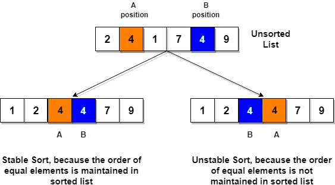

# 정렬 (Sort)

> __정렬이란?__
> 1. 가지런하게 줄지어 늘어섬. 또는 그렇게 늘어서게 함.
> 2. 데이터를 특정한 조건에 따라 일정한 순서가 되도록 다시 배열하는 일.

***

## 정렬의 종류
- Bubble Sort (버블 정렬)
- Selection Sort (선택 정렬)
- Insertion Sort (삽입 정렬)
- Merge Sort (합병 정렬)
- Quick Sort (퀵 정렬)
- Heap Sort (힙 정렬)
- Shell Sort (셸 정렬)
- Comb Sort (빗질 정렬)
- ...

***

## Bubble Sort
### 정의
서로 인접한 두 요소를 비교하여 정렬하는 알고리즘. 마치 거품이 일어나듯 연쇄적으로 정렬한다고 해서 버블 정렬이라는 이름이 붙여졌다.  
서로 인접한 요소를 비교한 후 크기가 큰 쪽이 오른쪽으로 가도록 자리를 바꿔가며 크기가 큰 요소를 오른쪽으로 밀어낸다.  


### 시간 복잡도
O(N^2)

### 장점
- 버블 정렬은 `in place` 알고리즘이기 때문에 메모리가 절약된다는 장점이 있다.  
💡 `in place`란 자료를 정렬할 때 추가적인 메모리 공간이 필요하지 않고, 데이터가 저장된 그 공간 내에서 정렬하는 것을 뜻한다.
- 다른 정렬에 비해 구현하기 쉽다.

### 단점
- 자료의 개수가 많아질수록 성능이 매우 떨어진다. 시간 복잡도가 O(n^2)이기 때문에 데이터가 5개라면 25번 순회해야 하지만, 데이터가 1,000개라면 1,000,000번을 순회해야 한다.

### Stable
버블 정렬은 `stable`한 정렬이다. 버블 정렬은 중복된 요소는 위치를 교환하지 않기 때문이다.  
💡 여기서 `stable`이라는 뜻은 배열 안에 중복 데이터가 있는 경우 정렬을 마친 후에도 중복 데이터의 순서가 유지되는 것을 말한다.


### 구현 
```javascript
function bubbleSort (array) {
  const copyArray = [...array];

  for (let i = 0; i < copyArray.length - 1; i++) {
    for (let j = 0; j < copyArray.length - 1 - i; j++) {
      if (copyArray[j] > copyArray[j + 1]) {
        const temp = copyArray[j];

        copyArray[j] = copyArray[j + 1];
        copyArray[j + 1] = temp;
      }
    }
  }

  return copyArray;
}
```

***

## Insertion Sort
### 정의
두 번째 자리 요소부터 시작하여 왼쪽 요소들과 비교한 후 알맞은 자리에 삽입하는 정렬하는 알고리즘.  


### 시간 복잡도
O(N^2)

### 장점
- `in place` 알고리즘이기 때문에 메모리가 절약된다.
- 다른 정렬에 비해 구현하기 쉽다.

### 단점
- 자료의 개수가 많아질수록 성능이 매우 떨어진다.

### Stable
중복된 요소는 위치를 교환하지 않기 때문에 `stable`한 정렬이다.

### 구현
```javascript
function insertionSort (array) {
  const copyArray = [...array];

  for (let i = 1; i < copyArray.length; i++) {
    const temp = copyArray[i];

    for (let j = i - 1; j >= 0 && copyArray[j] > temp; j--) {
      copyArray[j + 1] = copyArray[j];
    }

    copyArray[j + 1] = temp;
  }

  return copyArray;
}
```

***

## Merge Sort
### 정의
데이터들을 잘개 쪼갠 다음 하나로 합치는 과정에서 정렬하는 알고리즘.  
복잡하지만 성능이 좋아 자주 쓰이는 정렬 방법 중 하나이다.  


### 시간 복잡도
O(NlogN)

### 장점
- 다른 정렬에 비해 성능이 좋다.

### 단점
- 정렬할 때 추가적인 메모리가 필요하다.
- 다른 정렬에 비해 구현하기 어렵다.

### Stable
중복된 요소는 위치를 바꾸지 않기 때문에 `stable`한 정렬이다.

### 구현
```javascript
function merge (left, right) {
  const result = [];

  while (left.length && right.length) {
    if (left[0] <= right[0]) {
      result.push(left.shift());
    } else {
      result.push(right.shift());
    }
  }

  while (left.length) {
    result.push(left.shift());
  }

  while (right.length) {
    result.push(right.shift());
  }

  return result;
}

function mergeSort (array) {
  if (array.length) {
    return array;
  }

  const pivot = Math.floor(array.length / 2);
  const left = array.slice(0, pivot);
  const right = array.slice(pivot, array.length);
  return merge(mergeSort(left), mergeSort(right));
}
```
