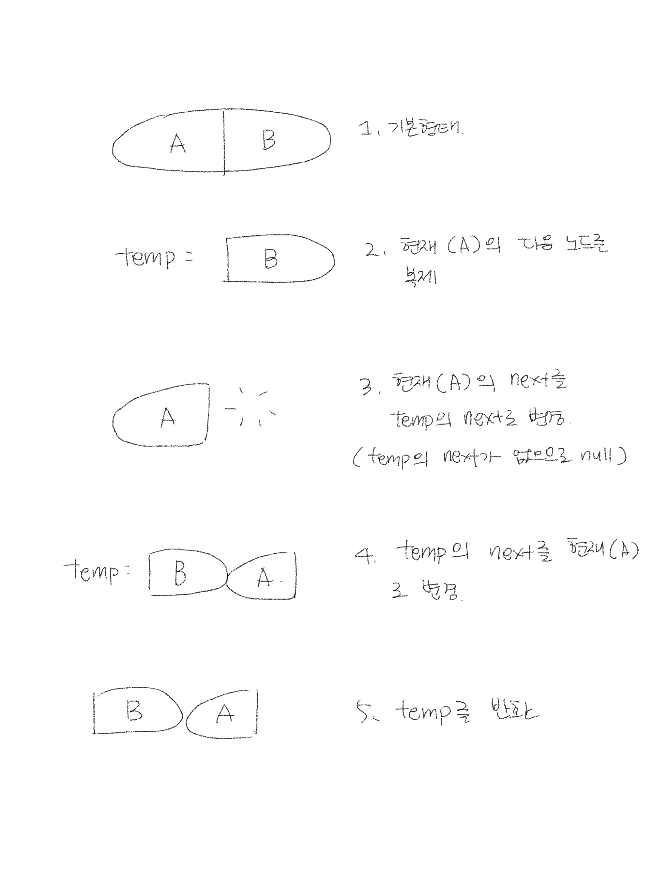

# 5주차 알고리즘
## Two Sum
### 문제 풀이
1. `result` 배열과 `nums`를 복사한 `copy`를 선언한다.
2. `for` 문을 이용하여 `nums`를 순회한다.
3. 현재의 숫자 `current`를 선언하고, `copy` 배열에서 해당 숫자를 `null`로 만든다.
```javascript
nums = [2, 3, 4]
current = 2
copy = [null, 3, 4]
```
4. `findIndex`를 이용해서 `num` + `current` === `target`이 되는 인덱스를 찾는다.
5. 해당 인덱스가 존재하면 `result`에 `push` 하고 반복문을 종료한다.
6. 만약 존재하지 않는다면 `null`이 들어있는 `copy` 배열을 다시 원상복구 해준다.
7. 최종적으로 `result`를 리턴한다.

### 시간 복잡도
반복문 안에서 `findIndex` 메서드를 사용하고 있으므로 O(n^2)

### 제출 코드
```javascript
var twoSum = function(nums, target) {
  const result = [];
  let copy = [...nums];
  
  for (let i = 0; i < nums.length; i++) {
    const current = copy[i];
    copy[i] = null;
    const index = copy.findIndex((num) => typeof num === 'number' && num + current === target);

    if (index >= 0) {
      result.push(i, index);
      break;
    }
    
    copy = [...nums];
  }
  
  return result;
};
```

## 3Sum
### 문제 풀이
1. `result` 배열과 `nums`를 오름차순으로 정렬한 `copy`를 선언한다.
2. `for` 문을 이용하여 `copy`를 순회한다.  
  이때 `i`, `i + 1`, `copy의 마지막 요소`를 확인해야 하므로 `copy.length - 2` 만큼 순회한다.
3. 배열의 `i` 번째 요소와 그 다음 요소 `left`, 마지막 요소 `right`를 선언한다.
4. `while` 문을 이용하여 셋의 합계가 0이면 `result` 배열에 `push` 한다.  
  그리고 `left`를 1만큼 올려주고 `right`를 1만큼 내려준다.
5. 셋의 합계가 0보다 크다면 `right`를 1만큼 내려준다.  
  `right`를 1만큼 내려주는 것은 오름차순으로 정렬된 `copy`에서 2번째로 큰 숫자를 가져오는 것이다.
6. 셋의 합계가 0보다 작다면 `left`를 1만큼 올려준다.  
  `left`를 1만큼 올려주는 것은 오름차순으로 정렬된 `copy`에서 2번째로 작은 숫자를 가져오는 것이다.
7. 반복문을 모두 순회한 후 `result` 배열을 반환한다.

### 시간 복잡도
반복문 안에서 `while` 문을 돌고 있으므로 O(n^2)

### 제출 코드
```javascript
var threeSum = function(nums) {
  const copy = [...nums].sort((a, b) => a - b);
  const result = [];
  
  for (let i = 0; i < copy.length - 2; i++) {
    let left = i + 1;
    let right = nums.length - 1;
    
    if (copy[i] === copy[i - 1]) {
      continue;
    }
    
    while (left < right) {
      const sum = copy[i] + copy[left] + copy[right];
      
      if (sum === 0) {
        result.push([copy[i], copy[left], copy[right]]);
        
        left += 1;
        right -= 1;
        
        while (copy[left] === copy[left - 1] && left < right) {
          left += 1;
        }
        
        while (copy[right] === copy[right + 1] && left < right) {
          right -= 1;
        }
      }
      
      if (sum > 0) {
        right -= 1;
      }
      
      if (sum < 0) {
        left += 1;
      }
    }
  }
  
  return result;
};
```

## Palindrome Linked List
### 문제 풀이
1. 링크드 리스트의 값들을 저장할 `numbers` 배열과 노드를 담을 `current`를 선언한다.
2. `while` 문을 돌면서 링크드 리스트의 값들을 `numbers`에 `push` 한다.
3. `numbers` 배열을 절반씩 자른다. 그리고 두 번째 배열(`rightNumbers`)은 반전시킨다.
4. `for` 문을 이용하여 `leftNumbers` 배열을 순회한다. 이때 `rightNumbers`와 비교하면서 값이 다를 경우 `false`를 반환한다.
5. 반복문을 다 돌때까지 `false`를 반환하지 않을 경우 `true`를 반환한다.

### 시간 복잡도
링크드 리스트를 모두 순회해야 하므로 O(n)

### 제출 코드
```javascript
var isPalindrome = function(head) {
  const numbers = [];
  let current = head;
  
  while(current) {
    numbers.push(current.val);
    current = current.next;
  }
  
  const leftNumbers = numbers.slice(0, numbers.length / 2);
  const rightNumbers = numbers.slice(numbers.length / 2).reverse();
  
  for (let i = 0; i < leftNumbers.length; i++) {
    if (leftNumbers[i] !== rightNumbers[i]) {
      return false;
    }
  }
  
  return true;
};
```

## Swap Nodes in Pairs
### 문제 풀이


### 제출 코드
```javascript
const swapPairs = (node) => {
  if (node === null || node.next === null) {
    return node;
  }

  const temp = node.next;

  node.next = temp.next;
  temp.next = node;
  node.next = swapPairs(node.next);

  return temp;
};
```
