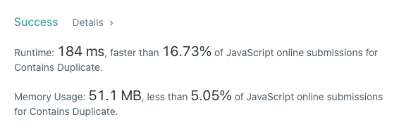
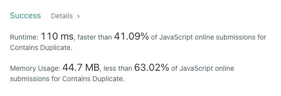

# 10주차 알고리즘
## Contains Duplicate
### 문제 풀이 01
1. merge sort를 이용하여 배열을 정렬한다.
2. 정렬된 배열을 순회한다. 중복된 값이 있을 경우 true를 반환하고, 반복문을 마칠 때까지 true를 반환하지 못했다면 false를 반환한다.

### 시간 복잡도 01
merge sort의 시간 복잡도는 O(n log n)이지만 정렬 후 반복문을 이용하여 중복을 찾아내므로 O(n)

### 제출 코드 01
```javascript
const merge = (left, right) => {
  const result = [];
  
  while (left.length && right.length) {
    if (left[0] < right[0]) {
      result.push(left.shift());
    } else {
      result.push(right.shift());
    }
  }
  
  return [...result, ...left, ...right];
};

const mergeSort = (nums) => {
  if (nums.length === 1) {
    return nums;
  }
  
  const middle = Math.floor(nums.length / 2);
  const left = nums.slice(0, middle);
  const right = nums.slice(middle);
  
  return merge(mergeSort(left), mergeSort(right));
};

const containsDuplicate = function(nums) {
  const sorted = mergeSort(nums);
  
  for (let i = 0; i < sorted.length - 1; i++) {
    if (sorted[i]  === sorted[i + 1]) {
      return true;
    }
  }
  
  return false;
};
```

### 결과 01


### 문제 풀이 02
1. `set`을 이용하여 중복 값을 제거한 객체를 생성한다.
2. 인자로 받은 `nums`의 length와 `set`의 size를 비교한다.

### 제출 코드 02
```javascript
var containsDuplicate = function(nums) {
  return new Set(nums).size < nums.length;
};
```

### 결과 02


## Best Time to Buy and Sell Stock
### 문제 풀이
1. 결과값을 저장할 `result`와 배열의 최솟값을 저장할 `min`을 선언한다.
2. `prices`를 순회한다.
3. `min`은 저장된 값과 현재의 값을 비교하면서 더 작은 숫자로 업데이트한다.
4. `result`는 저장된 값과 `현재값 - 최솟값`을 비교하여 더 큰 숫자로 업데이트한다.
5. `result`를 반환한다.

### 시간 복잡도
O(n)

### 제출 코드
```javascript
var maxProfit = function(prices) {
  let result = 0;
  let min = prices[0];

  for(let i = 1; i < prices.length; i++) {
    min = Math.min(prices[i], min);
    result = Math.max(result, prices[i] - min);
  }
  
  return result;
};
```
